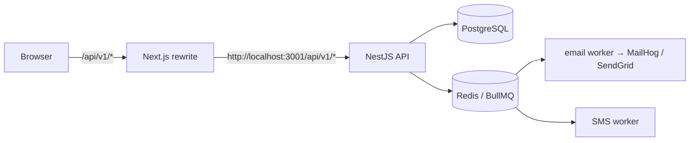
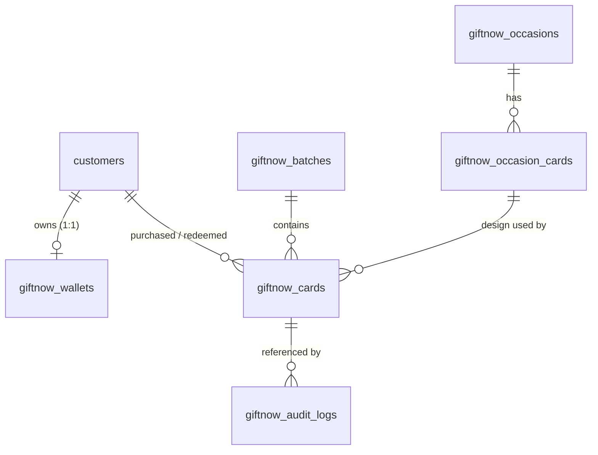
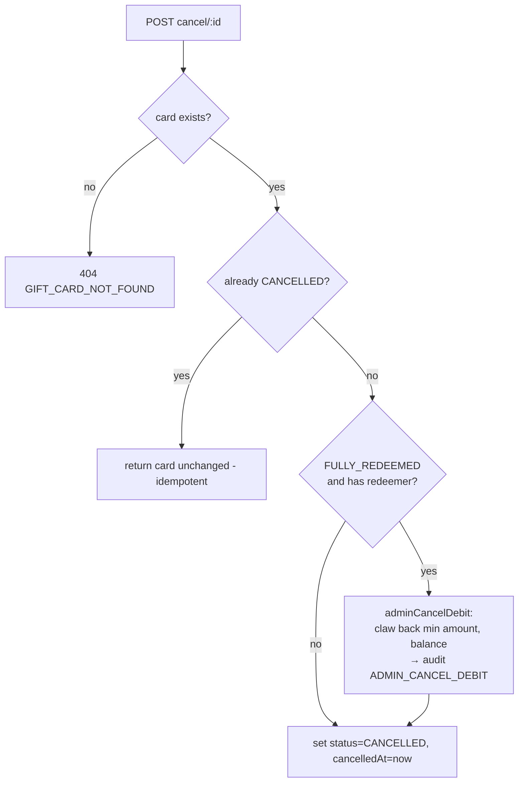
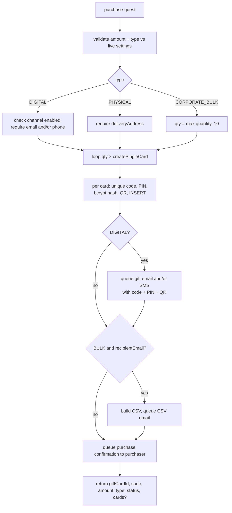

# GiftNow — Admin Panel, My Wallet & Buy Cards

**Integration reference.** This document describes three feature areas of the GiftNow platform in enough detail that an engineer (or an AI agent) can re-implement them, port them into another product, or drive them from an external system without reading the source.

- **Admin Panel** — the full `/admin/giftnow/*` surface and the API behind it
- **My Wallet** — `/customer/wallet` (balance, redemption, audit log)
- **Buy Cards** — `/giftnow/buy` (guest gift card purchase)

Everything below was derived from the code as it exists in this repository. Where the code and the intent disagree, the code is documented and the discrepancy is called out in [Known gaps and traps](#12-known-gaps-and-traps). **Read that section before integrating** — several endpoints referenced by the UI do not exist on the server.

---

## 1. What this system is

GiftNow is a gift card platform for Su Indra Groups Pvt. Ltd. (Nepal). The central idea:

> A gift card is a **bearer claim code**. Redeeming that code moves its face value, once and permanently, into the redeemer's **platform wallet**. The card is then dead; the wallet balance lives forever and is spendable anywhere on the platform.

Three consequences shape the whole design:

1. **Cards are never partially redeemed.** A card is `ACTIVE`, `FULLY_REDEEMED`, or `CANCELLED`. There is no remaining-balance concept on a card. Value lives on the wallet after redemption.
2. **Wallets never expire and are non-transferable.** One wallet per customer account, keyed by `accountId`.
3. **Every balance change is written to an append-only audit log** in the same database transaction as the balance update. The audit log — not the wallet row — is the source of truth for history.

Currency is **NPR**, whole rupees only. No decimals are accepted on input despite `Decimal(12,2)` columns.

---

## 2. Architecture and topology

```
giftcard-frontend/   Next.js 14 (App Router, "use client" pages) — port 3000
giftcard-backend/    NestJS 10 + Prisma + PostgreSQL          — port 3001
                     BullMQ + Redis for email/SMS delivery queues
```

Every backend route is prefixed **`/api/v1`** (`app.setGlobalPrefix("api/v1")` in [main.ts](giftcard-backend/src/main.ts)). Swagger UI is served at `/api/v1/docs`.

The frontend never hardcodes the backend host. It calls the relative path `/api/v1/...`, and Next rewrites it:

```js
// giftcard-frontend/next.config.js
async rewrites() {
  return [{ source: "/api/v1/:path*", destination: `${backendUrl}/api/v1/:path*` }];
}
```

`API_BASE_URL` in [api.ts](giftcard-frontend/src/lib/api.ts) is `process.env.NEXT_PUBLIC_API_URL || "/api/v1"`. **To point this UI at a different backend, set `NEXT_PUBLIC_API_URL` (browser-side, absolute URL) or `BACKEND_URL` (rewrite target, server-side).** That is the only wiring needed.



### Global request rules

Set once in `main.ts`, and they will bite you if you ignore them:

- **`ValidationPipe({ whitelist: true, transform: true, forbidNonWhitelisted: true })`** — any body property not declared on the DTO causes a **400**, it is not silently dropped. Send exactly the documented fields.
- **CORS** — `origin: process.env.CORS_ORIGIN || "*"`, credentials allowed.

---

## 3. Authentication and roles

### Token

JWT, sent as `Authorization: Bearer <token>`. Signed with `JWT_SECRET` (dev fallback `"giftnow-dev-secret"`), expiring after `JWT_EXPIRY` (default `7d`).

Payload ([jwt-payload.interface.ts](giftcard-backend/src/auth/jwt-payload.interface.ts)):

```ts
interface JwtPayload {
  userId: string;   // Customer.id OR Admin.id — the two tables share no ID space
  role: string;     // "CUSTOMER" | "ADMIN" | "SUPER_ADMIN" | "MODERATOR"
  email?: string;
}
```

The JWT strategy does no database lookup — it returns the payload verbatim as `req.user`. **A token stays valid for its full 7 days even if the account is deactivated or deleted.**

### Roles

| Role | Source table | How obtained |
|------|-------------|--------------|
| `CUSTOMER` | `customers` | Google sign-in or email/phone OTP |
| `ADMIN` / `SUPER_ADMIN` / `MODERATOR` | `admins` | `POST /auth/login` with email + password (bcrypt) |

`RolesGuard` reads the `@Roles(...)` decorator; if the list is empty the route is open to any authenticated user. Guards run in declaration order — `@UseGuards(JwtAuthGuard, RolesGuard)` — so `req.user` is populated before the role check.

### Auth endpoints

| Endpoint | Body | Returns |
|---|---|---|
| `POST /api/v1/auth/login` | `{ email, password }` | `{ message, data: { token, user } }` |
| `POST /api/v1/auth/google` | `{ credential }` (Google ID token) | `{ message, data: { token, user } }` |
| `POST /api/v1/auth/otp/send` | `{ email? , phone? }` | `{ success, message }` |
| `POST /api/v1/auth/otp/verify` | `{ email?, phone?, code, firstName?, lastName? }` | `{ message, data: { token, user } }` |
| `GET /api/v1/auth/me` | — (JWT) | `{ data: user }` |

### Client-side session

[AuthProvider.tsx](giftcard-frontend/src/components/AuthProvider.tsx) stores the token in `localStorage` under **`authToken`** and the user object under **`authUser`**, then revalidates via `GET /auth/me` on mount. `getHeaders()` in `api.ts` reads `authToken` on every call.

> **Trap:** `AuthProvider` computes `isAdmin = user?.role === "ADMIN"`. Every admin page gates on this flag, so **`SUPER_ADMIN` and `MODERATOR` users are locked out of the admin UI even though the API accepts them.** If you port this, change the check to `["ADMIN","SUPER_ADMIN","MODERATOR"].includes(user?.role)`.

---

## 4. Data model

Prisma schema: [schema.prisma](giftcard-backend/prisma/schema.prisma). Table names are explicitly mapped and all differ from the model names.



| Model | Table | Purpose |
|---|---|---|
| `Customer` | `customers` | Wallet owner. Google or OTP identity. |
| `Admin` | `admins` | Operator. `role`, bcrypt `password`. |
| `GiftCard` | `giftnow_cards` | The card itself. |
| `GiftCardWallet` | `giftnow_wallets` | One per `accountId` (unique). `balance`, `totalCredited`, `totalDebited`. |
| `GiftCardAuditLog` | `giftnow_audit_logs` | Append-only ledger. Never updated or deleted. |
| `GiftCardBatch` | `giftnow_batches` | Groups admin bulk creations. |
| `Occasion` | `giftnow_occasions` | Festival/event category (Dashain, Tihar…). |
| `OccasionCard` | `giftnow_occasion_cards` | An image template belonging to an occasion. |
| `PlatformSetting` | `giftnow_settings` | Key/value JSON. Only key in use: `platform_settings`. |
| `Otp` | `giftnow_otps` | Short-lived OTP codes (5 min TTL). |

### GiftCard — the fields that carry meaning

```prisma
code                 String @unique @db.VarChar(32)  // GN-XXXX-XXXX-XXXX-XXXXXXXX
type                 GiftCardType    // DIGITAL | PHYSICAL | CORPORATE_BULK
amount               Decimal @db.Decimal(12,2)
status               GiftCardStatus  // ACTIVE | FULLY_REDEEMED | CANCELLED
isCustomerPurchase   Boolean @default(false)  // ← decides the redemption method
pinHash              String? @db.VarChar(72)  // bcrypt of the 6-digit PIN
pinAttempts          Int     @default(0)      // lockout counter, max 5
purchasedByAccountId String? @db.Uuid         // null for guest purchases
redeemedByAccountId  String? @db.Uuid
recipientEmail       String?
recipientPhone       String? @db.VarChar(30)
deliveryChannel      String  @default("EMAIL")  // EMAIL | SMS | BOTH
cardDesignId         String? @db.Uuid           // → OccasionCard
batchId              String? @db.Uuid           // → GiftCardBatch
qrCode               String?                    // data: URL, generated at creation
```

**`isCustomerPurchase` is the most load-bearing boolean in the system.** It routes the entire redemption flow:

- `false` (admin-issued) → redeem with the **static 6-digit PIN**
- `true` (customer/guest-bought) → redeem with a **one-time OTP** sent to the recipient

### Audit log

```prisma
operation     AuditOperation  // CREDIT | DEBIT | ADMIN_CANCEL_DEBIT | REFUND_CREDIT
amount        Decimal
balanceBefore Decimal
balanceAfter  Decimal
performedBy   String @db.Uuid   // actor (self for redeem/debit, admin id for cancel)
giftCardId    String? @db.Uuid  // set on redemption / admin cancel
orderId       String? @db.VarChar(64)  // set on merchant debit
```

`REFUND_CREDIT` is declared in the enum but **never written by any code path**. `ADMIN_CANCEL_DEBIT` is what an admin cancellation actually produces (a debit, despite the "refund" label the wallet UI shows for it).

---

## 5. Cross-cutting conventions

### Response envelope — inconsistent, read carefully

There are **two** shapes and no rule you can infer from the URL:

| Shape | Used by |
|---|---|
| `{ data, pagination? }` | admin list, analytics, batch, occasions, settings, wallet history, purchased, `/auth/me` |
| **Bare object, no `data` key** | `GET /gift-cards/wallet`, `POST /gift-cards/redeem`, `POST /gift-cards/redeem/send-otp`, `POST /gift-cards/purchase`, `POST /gift-cards/purchase-guest`, `POST /gift-cards/admin/create`, `POST /gift-cards/wallet/debit`, checkout |

The frontend copes by probing both (`res.requiresOtp ?? res.data?.requiresOtp`). **If you build a new client, treat the envelope as per-endpoint and consult the table above.**

### Error format

`GiftNowHttpException` ([exceptions.ts](giftcard-backend/src/common/exceptions.ts)) emits `{ error: CODE, message: string }` with a mapped HTTP status:

| Code | HTTP | Meaning |
|---|---|---|
| `GIFT_CARD_NOT_FOUND` | 404 | Unknown code, or malformed code (deliberately indistinguishable) |
| `GIFT_CARD_ALREADY_REDEEMED` | 409 | Already `FULLY_REDEEMED` |
| `GIFT_CARD_CANCELLED` | 410 | Admin cancelled it |
| `INVALID_AMOUNT` | 422 | Outside min/max, not an integer, or type disabled |
| `INSUFFICIENT_WALLET` | 422 | Debit exceeds balance |
| `INVALID_PIN` | 403 | Wrong/missing PIN or OTP (message carries attempts remaining) |
| `CARD_PIN_LOCKED` | 423 | 5 failed attempts |
| `RATE_LIMIT_EXCEEDED` | 429 | Redeem rate limit |
| `CHANNEL_DISABLED` | 403 | Admin disabled that delivery channel |
| `UNAUTHORIZED` | 401 | — |

The client wraps these in `GiftNowApiError { code, message }` and maps codes to friendly copy via `ERROR_MESSAGES` in `api.ts`, preferring the server `message` when it differs from the code.

### Claim code format

`GN-XXXX-XXXX-XXXX-XXXXXXXX` — 22 characters. Alphabet: `ABCDEFGHJKLMNPQRSTUVWXYZ23456789` (**no `0`, `O`, `1`, `I`** — unambiguous when read aloud or off a printed card).

Generated in [code-generator.ts](giftcard-backend/src/common/utils/code-generator.ts) from a UUID (with `O→P`, `0→2`, `I→J`, `1→3` substitutions) plus 8 CSPRNG characters. `generateUniqueCode()` retries up to 5 times against the unique index.

`normalizeGiftNowCode()` is forgiving on input: it uppercases, strips everything outside the alphabet, drops a leading `GN`, and re-inserts dashes. Users can paste `gn xxxx xxxx…` or lowercase and it will still match. The same logic is mirrored client-side in [giftnow.ts](giftcard-frontend/src/lib/giftnow.ts).

### Security PIN

`generateSecurityPin()` → `randomInt(0, 1_000_000)` zero-padded to 6 digits (so `000042` is a valid PIN). Stored **only** as a bcrypt hash (cost 10). The plaintext is returned exactly once, in the creation response, and is otherwise unrecoverable — reset is the only path.

### Money formatting

`formatNPR()` uses **Indian digit grouping** (2-2-3), not Western: `formatNPR(100000)` → `"NPR 1,00,000"`. Two independent implementations exist ([lib/format.ts](giftcard-frontend/src/lib/format.ts) and [lib/giftnow.ts](giftcard-frontend/src/lib/giftnow.ts)); pages import from `format`.

`toNumber()` on the backend `parseFloat`s Prisma `Decimal` values before they cross the API boundary — **the API emits JSON numbers, not decimal strings.** Client code still defensively coerces with `Number(v)`.

---

## 6. The wallet engine

Everything in the admin panel and the wallet page ultimately calls into [wallet.service.ts](giftcard-backend/src/wallet/wallet.service.ts). This is the piece to port most carefully.

### Concurrency: pessimistic row locks

Both credit and debit take a `FOR UPDATE` lock via raw SQL before reading the balance:

```ts
const wallets = await tx.$queryRaw<any[]>`
  SELECT * FROM "giftnow_wallets" WHERE "accountId" = ${accountId}::uuid FOR UPDATE
`;
```

The read-modify-write then happens inside the same transaction, so concurrent redemptions or debits on one wallet serialize instead of racing. **This is PostgreSQL-specific** (`FOR UPDATE`, `::uuid` cast) — porting to MySQL or SQLite requires rewriting these three queries.

`creditWallet` additionally handles the first-credit case: if no wallet row exists it creates one, locks it, and falls back to re-selecting on a unique-constraint race (two simultaneous first credits).

### Operations

| Method | Writes audit op | Notes |
|---|---|---|
| `getOrCreateWallet(accountId)` | — | Lazily creates a zero wallet. |
| `getBalance(accountId)` | — | Creates the wallet if absent, so it never 404s. |
| `creditWallet(accountId, amount, performedBy, giftCardId?, op="CREDIT", tx?)` | `CREDIT` | Accepts an outer `tx` so redemption can atomically flip the card **and** credit the wallet. |
| `debitWallet(accountId, amount, performedBy, orderId?)` | `DEBIT` | Throws `INSUFFICIENT_WALLET` if `balance < amount`, or if no wallet row exists at all. |
| `adminCancelDebit(accountId, amount, performedBy, giftCardId)` | `ADMIN_CANCEL_DEBIT` | **Clamps to available balance** (`Math.min(amount, balanceBefore)`) and returns `{debited: 0}` rather than throwing when the wallet is missing or empty. Cancellation must never fail. |
| `getHistory(accountId, limit=50, offset=0)` | — | Audit rows, `createdAt desc`. |

**The clamping in `adminCancelDebit` is a deliberate business decision with a real consequence:** if a customer redeems a NPR 5,000 card and spends the money, an admin cancelling that card claws back only what is left. The platform eats the difference. The wallet can never go negative.

`totalCredited` and `totalDebited` are running lifetime counters. Note `ADMIN_CANCEL_DEBIT` increments `totalDebited`, so "lifetime debits" on the wallet page includes admin clawbacks.

---

## 7. Admin Panel

### Route map

| Route | File | Backend calls |
|---|---|---|
| `/admin/giftnow` | [page.tsx](giftcard-frontend/src/app/admin/giftnow/page.tsx) | `admin/analytics`, `admin/list`, `admin/export` |
| `/admin/giftnow/create` | [create/page.tsx](giftcard-frontend/src/app/admin/giftnow/create/page.tsx) | `admin/create` |
| `/admin/giftnow/list` | [list/page.tsx](giftcard-frontend/src/app/admin/giftnow/list/page.tsx) | `admin/list`, `admin/cancel/:id`, `admin/reset-pin/:id`, `admin/export` |
| `/admin/giftnow/analytics` | [analytics/page.tsx](giftcard-frontend/src/app/admin/giftnow/analytics/page.tsx) | `admin/analytics` |
| `/admin/giftnow/settings` | [settings/page.tsx](giftcard-frontend/src/app/admin/giftnow/settings/page.tsx) | `admin/settings` GET + PUT |
| `/admin/giftnow/occasions` | [occasions/page.tsx](giftcard-frontend/src/app/admin/giftnow/occasions/page.tsx) | full occasions CRUD + image upload |
| `/admin/giftnow/batch/[id]` | [batch/[id]/page.tsx](giftcard-frontend/src/app/admin/giftnow/batch/[id]/page.tsx) | `admin/batch/:batchId`, `admin/reset-pin/:id` |
| `/admin/giftnow/discounts` | [discounts/page.tsx](giftcard-frontend/src/app/admin/giftnow/discounts/page.tsx) | ⚠️ `admin/bulk-discounts` — **endpoint does not exist** |

Nav links in [SiteHeader.tsx](giftcard-frontend/src/components/SiteHeader.tsx) (rendered only when `isAdmin`): Cards List, Analytics, Create Cards, Occasions, Settings. `/admin/giftnow` (the dashboard) and `/admin/giftnow/discounts` are **not linked from anywhere** — they are reachable only by typing the URL.

### Page-level auth pattern

Every admin page repeats this guard inline rather than using a shared wrapper:

```tsx
const { user, isAdmin } = useAuth();
if (!user || !isAdmin) {
  return <Layout>… "Sign in as admin" button →
    sessionStorage.setItem("authRedirect", "/admin/giftnow/list");
    openAuth("signin");
  …</Layout>;
}
```

This is **client-side cosmetics only.** There is no middleware and no server-side route protection — the pages ship to any browser that requests them. Actual enforcement is entirely on the API (`JwtAuthGuard` + `RolesGuard`). That is the correct security boundary, but it means an unauthenticated visitor briefly renders the page shell.

### API surface

All routes below are under `/api/v1/gift-cards/admin`, guarded by `@UseGuards(JwtAuthGuard, RolesGuard)` + `@Roles("SUPER_ADMIN","ADMIN","MODERATOR")` at the controller level ([admin.controller.ts](giftcard-backend/src/admin/admin.controller.ts)).

#### `POST /create`

Body ([AdminCreateDto](giftcard-backend/src/admin/dto/admin-create.dto.ts)):

```jsonc
{
  "type": "DIGITAL",           // required: DIGITAL | PHYSICAL | CORPORATE_BULK
  "amount": 1000,              // required int, 100..100000 (DTO-enforced)
  "quantity": 10,              // optional int 1..1000
  "amounts": [500, 1000],      // optional int[] — overrides amount+quantity
  "recipientEmail": "a@b.com", // optional
  "personalMessage": "…",      // optional
  "deliveryAddress": {},       // optional object
  "batchName": "Q1 Corp",      // optional
  "cardDesignId": "uuid"       // optional → OccasionCard
}
```

Logic in `GiftcardService.adminCreate` ([giftcard.service.ts](giftcard-backend/src/giftcard/giftcard.service.ts)):

1. `amounts` wins if non-empty; otherwise `Array(quantity ?? 1).fill(amount)`. So mixed-denomination batches are supported by the API even though the UI never sends `amounts`.
2. Each amount is validated against **live platform settings** (min/max/enabled types), not just the DTO bounds.
3. **Batch branch** — taken if `amounts.length >= 10` **or** `type === "CORPORATE_BULK"`: creates a `GiftCardBatch`, then one card per amount with `batchId` set. Returns `{ batchId, cards: [{id, code, pin, amount}] }`.
4. **Single branch** — returns `{ giftCardId, code, pin, amount, type, status }`.

Every created card gets `isCustomerPurchase: false`, a fresh PIN (bcrypt-hashed), and a QR data-URL.

> **Admin-created cards are never emailed.** `adminCreate` does not call `DeliveryService` at all beyond QR generation. Even with `type: "DIGITAL"` and a `recipientEmail`, nothing is sent — the operator is expected to distribute the codes from the response or the CSV export. Customer purchases *do* send mail. If you need admin issuance to deliver, you must add that call.

#### `GET /list`

Query: `status`, `type`, `createdBy` (`ADMIN` | `CUSTOMER` — maps to `isCustomerPurchase: false/true`), `code` (case-insensitive `contains`), `startDate`, `endDate` (inclusive; end is pushed to `23:59:59.999`), `limit` (default 50), `offset` (default 0).

Returns `{ data: GiftCard[], pagination: { total, limit, offset } }`.

`listCards` enriches each row by batch-fetching the referenced customers and attaching `purchasedByCustomer` and `redeemedByCustomer` (`{id, name, email} | null`). This is a manual join — `GiftCard` has no Prisma relation to `Customer`, because `purchasedByAccountId`/`redeemedByAccountId` are plain UUID columns without FK constraints.

**`pinHash` is included in the response rows.** It is a bcrypt hash so it is not directly exploitable, but it should not be leaving the server. Strip it if you port this.

#### `GET /analytics`

Returns `{ data: {...} }` — nine aggregates, each its own query (nine round-trips, no caching):

```jsonc
{
  "totalCardsIssued": 120,
  "totalValueIssued": 250000,
  "totalRedeemedCount": 45,
  "activeCardsCount": 70,
  "outstandingWalletBalances": 82000,  // SUM(giftnow_wallets.balance)
  "redemptionRate": "37.5%",           // string, pre-formatted with %
  "averageDenomination": 2083.33,
  "adminCreatedCount": 100,
  "customerPurchasedCount": 20
}
```

`redemptionRate` arrives as a **formatted string**; every other field is a number. The dashboard tile component renders it as-is.

#### `POST /cancel/:id`

The most consequential admin action.



Cancelling an unredeemed card simply kills it. Cancelling a **redeemed** card also claws money back from the redeemer's wallet — clamped to their current balance, so a spent-down wallet yields a partial or zero recovery and the operation still succeeds.

Returns `{ data: card }`.

#### `POST /reset-pin/:id`

Generates a new PIN, bcrypt-hashes it, sets `pinAttempts: 0` (clearing any lockout), and **emails the new PIN** to `recipientEmail || purchaserEmail` — best-effort, errors are caught and logged, not surfaced.

Returns `{ data: { pin: "123456" } }` — the plaintext PIN, **always**, regardless of card ownership.

The list UI decides on its own whether to display it:

```tsx
setResetPinResult({
  code,
  pin: isCustomerPurchase ? undefined : res.data?.pin,  // hidden for customer cards
  isCustomerPurchase,
});
```

For a customer-purchased card the operator is told "the PIN has been sent to the recipient's mail" and the value is withheld from the screen — **but the API already sent it over the wire.** This is UI theatre, not a server-side control. If the intent is that operators cannot see PINs on customer-owned cards, enforce it in the controller.

Also note: resetting the PIN of a **customer-purchased** card accomplishes nothing operationally, because those cards redeem via OTP and never check `pinHash`. The one useful side effect is clearing `pinAttempts` — which is exactly what un-sticks an OTP-locked card, since both flows share that counter.

#### `GET /batch/:batchId`

Returns `{ data: { batch, cards, redemptionRate } }`, with `redemptionRate` as a fixed(1) **string** (e.g. `"40.0"`, no `%`) and each card carrying `redeemedByCustomer`. 404s via `GIFT_CARD_NOT_FOUND` if the batch is unknown.

#### `GET /export`

Query: `status`, `type`, `createdBy`. Streams `text/csv` with `Content-Disposition: attachment; filename="giftnow-export.csv"`, capped at 10,000 rows.

Columns: `id, code, type, amount, status, pinProtected, pinLocked, issuedBy, purchaserName, purchaserEmail, purchasedByAccountId, redeemedByAccountId, createdAt, redeemedAt`.

`pinProtected` is `Yes`/`No`; `pinLocked` is `LOCKED`/`No`; `issuedBy` is `Customer`/`Admin`. **PINs are never exported** (only their existence). Fields are joined with `,` and **not escaped or quoted** — a `personalMessage` is not exported so the practical risk is low, but a comma in `purchaserName` will corrupt the row.

The client turns the response into a download via `blob()` → `URL.createObjectURL` → synthetic `<a download>` click.

#### Settings — `GET/PUT /gift-cards/admin/settings`

Lives on `GiftcardController`, not `AdminController`. **`GET` allows `MODERATOR`; `PUT` is restricted to `SUPER_ADMIN` and `ADMIN`** — the only place in the codebase where write access is narrower than read.

Stored as a single JSON row in `giftnow_settings` under key `platform_settings` ([settings.service.ts](giftcard-backend/src/giftcard/settings.service.ts)):

```jsonc
{
  "minAmount": 100,
  "maxAmount": 100000,
  "enabledTypes": ["DIGITAL", "PHYSICAL", "CORPORATE_BULK"],
  "enabledChannels": ["EMAIL", "SMS"]
}
```

Reads fall back to the defaults above field-by-field if the row is missing or a field is the wrong type. `updateSettings` merges over current values, so a partial `PUT` is safe — but **the UI always sends all four fields**, and the `PUT` handler is typed `@Body() body: any` (no DTO, therefore **no validation** — `minAmount: -5` or `enabledTypes: ["NONSENSE"]` will persist).

These settings are read live on **every** purchase and admin-create, so changes take effect immediately with no restart or cache flush.

> **Trap:** `AdminCreateDto` / `PurchaseGuestGiftCardDto` hardcode `@Min(100) @Max(100000)`. Raising `maxAmount` to 200000 in settings changes the UI hints and the service-level check, but the DTO still rejects the request with a **400 before the service ever runs**. Min/max are only adjustable *within* 100–100,000. To truly make them dynamic, drop the DTO bounds and rely on `validateDynamicAmountAndType`.

#### Occasions — `/api/v1/gift-cards/occasions`

| Method | Path | Roles | Notes |
|---|---|---|---|
| `GET` | `/` | **public** | Active occasions + cards, ordered by `order asc` |
| `GET` | `/admin/list` | admin | All occasions incl. inactive |
| `POST` | `/admin` | admin | Create; slug lowercased/trimmed |
| `PATCH` | `/admin/:id` | admin | Update |
| `DELETE` | `/admin/:id` | admin | Cascades to its cards (`onDelete: Cascade`) |
| `POST` | `/admin/:id/cards` | admin | Add template; `isDefault: true` unsets siblings in a transaction |
| `PATCH` | `/admin/:id/cards/:cardId/default` | admin | Promote to default |
| `DELETE` | `/admin/cards/:cardId` | admin | Delete template |
| `POST` | `/admin/upload-card?occasionSlug=x` | admin | `multipart/form-data`, field name **`file`** |

`OccasionCard.valueBox` is a JSON blob `{ top, right, width }` — CSS percentages positioning the amount text over the artwork, plus `valueColor`. The admin UI exposes these as text inputs (defaults `48%` / `6%` / `34%`) with a live preview.

**The upload endpoint writes into the frontend's public directory:**

```ts
const destDir = join(process.cwd(), "..", "giftcard-frontend", "public", "cards", safeName);
```

The slug is sanitized (`/[^a-z0-9-_]/gi` stripped, fallback `"general"`) so path traversal is blocked, and filenames are randomized (`uploaded-<ts>-<rand><ext>`). But the API **must** run from a sibling directory of the frontend on a shared writable filesystem. This breaks under Docker, serverless, split deploys, or multi-instance backends. Porting this means replacing disk storage with object storage (S3/GCS) and returning the CDN URL instead of `/cards/<slug>/<file>`. There is also **no MIME or size validation** — any file type is accepted.

`OccasionModule.onModuleInit` calls `seedDefaultOccasions()`, which **no-ops in production** (`NODE_ENV === "production"`) and no-ops if any occasion already exists. In dev it upserts Dashain, Tihar, Teej, Buddha Jayanti, Holi (inactive), Losar, Birthday, Wedding with hardcoded UUIDs.

### Dashboard — `/admin/giftnow`

The thinnest page: `AdminGiftNowDashboard` (7 analytics tiles) + an unfiltered, unpaginated card table (first 50 by default) + Export CSV.

### Create page — `/admin/giftnow/create`

Two-column layout: form left, live gift card preview right (sticky).

- Type toggle offers only **DIGITAL** and **CORPORATE_BULK** (`PHYSICAL` is in the enum and the settings screen but has no create UI).
- `amount` and `quantity` are held as **strings**, not numbers, and sanitized with `.replace(/[^0-9]/g, "")` on change — deliberate, so backspacing to empty and typing leading zeros behave. Converted with `parseInt(x, 10) || 0` at submit.
- Any field edit clears the previous success/preview state (a card shown after creation must never look like it belongs to the values now on screen).
- Client validation: `validateGiftNowAmount` (hardcoded 100–100,000 from `lib/giftnow.ts`, **not** the live settings) and `quantity >= 10` for bulk.
- On bulk success: renders the generated code/PIN/amount list and offers a client-side CSV export (`index,code,pin,amount,batchId`) built from the response — the **only place the plaintext PINs of a batch can be captured.** Navigate away and they are gone forever.

### List page — `/admin/giftnow/list`

Filters: code search, status, type, issuer, date range, plus Clear Filters. `useEffect(..., [filter])` refetches on every change — **no debounce, so the code search fires a request per keystroke.**

Each card renders as a row with an **Inquire** expander (created/redeemed timestamps, purchaser and recipient details, personal message, redeemer identity, cancellation time, `pinAttempts / 5`), and for `ACTIVE` cards a **Reset PIN** and **Cancel** button, both behind `window.confirm`.

The type column only maps `DIGITAL` and `CORPORATE_BULK` → a `PHYSICAL` card renders a **blank cell**.

Pagination state exists (`useState({limit: 50, offset: 0})`) but **is never sent and has no controls** — the page is permanently stuck on the first 50 results.

### Analytics page — `/admin/giftnow/analytics`

Eight read-only tiles over the same `admin/analytics` payload. Loads once on mount; no refresh, no date range, no charts.

### Settings page — `/admin/giftnow/settings`

Toggles for the three card types and two delivery channels, plus min/max number inputs. Client-side guards: at least one type, at least one channel (also blocked at toggle time), `minAmount > 0`, `maxAmount >= minAmount`. Saves all four fields at once. Uses `react-hot-toast` for feedback.

### Batch detail — `/admin/giftnow/batch/[id]`

Four summary tiles (total cards, total value, redemption rate, created date) plus the card table with per-card Reset PIN. Lock badges appear at `pinAttempts >= 5`, warning badges at `1..4`.

Its redemption-rate expression is `cards.filter(redeemed).length / cards.length > 0 ? …toFixed(1)+"%" : "0%"` — which **divides by zero on an empty batch** (`NaN > 0` is `false`, so it renders `"0%"` and doesn't crash, but the ternary condition is meaningless). The server already returns a correct `redemptionRate`; the page ignores it and recomputes.

### Discounts page — `/admin/giftnow/discounts` ⚠️

**Non-functional.** The page renders a tier editor seeded with hardcoded defaults (10–49 → 2%, 50–99 → 5%, 100–499 → 8%, 500–999 → 10%, 1000–9999 → 12%) and calls `giftnowAPI.adminSetBulkDiscounts` → `PUT /gift-cards/admin/bulk-discounts`.

**That route does not exist on the backend.** Every save 404s and shows an error toast. There is no discounts table, no read endpoint, and no code path anywhere that applies a quantity discount — bulk pricing is `amount × quantity`, flat. The page is an unimplemented mock. Either build the backend or delete the page; do not port it as-is.

---

## 8. My Wallet — `/customer/wallet`

```
Layout(activePath="/customer/wallet", showFooter)
  └─ RequireAuth(redirectTo="/customer/wallet")
       └─ WalletContent
```

[RequireAuth](giftcard-frontend/src/components/RequireAuth.tsx) shows a loading state, then a sign-in/create-account prompt for anonymous visitors, stashing `sessionStorage.authRedirect` first. It **renders** the prompt rather than redirecting, so the URL is preserved.

The page has three sections: balance, redeem, audit log.

### Load

On mount, two independent fetches:

| Call | Endpoint | Envelope | Failure handling |
|---|---|---|---|
| `getWallet()` | `GET /gift-cards/wallet` | **bare object** | swallowed — "wallet will be created on first access" |
| `getWalletHistory(100, 0)` | `GET /gift-cards/wallet/history?limit=100&offset=0` | `{ data, pagination }` | swallowed → empty list |

Neither surfaces an error. A dead backend renders as an empty NPR 0 wallet. `getBalance` auto-creates the wallet row, so a brand-new customer sees zeros rather than a 404.

History is fetched **once at 100 rows** and filtered client-side. There is no pagination UI — transaction 101 is unreachable.

### Balance display

A dark gradient card: available balance, "No Expiry" badge, `totalCredited`, `totalDebited`; beside it three plain stat rows (active balance, lifetime credits, lifetime debits) restating the same three numbers. A "Start Shopping" button links out to `https://www.buynownp.com/` — the sister storefront this wallet is meant to fund. **Hardcoded; parameterize it when porting.**

### Redemption — the two-step flow

This is the most intricate flow in the product. The client does not know in advance whether a card needs a PIN or an OTP; step 1 asks the server.

```mermaid
sequenceDiagram
  participant U as Customer
  participant W as Wallet page
  participant A as API
  participant D as Email/SMS queue

  U->>W: enter GN-code, "Verify Code"
  W->>A: POST /gift-cards/redeem/send-otp {code}
  A->>A: normalize + validate format
  A->>A: load card; reject if redeemed/cancelled
  alt isCustomerPurchase == false (admin-issued)
    A-->>W: {requiresOtp: false}
    Note over W: step 2 asks for the static PIN
  else isCustomerPurchase == true
    A->>A: pick channel, create Otp row (5 min TTL)
    A->>D: queue OTP email/SMS
    A-->>W: {requiresOtp: true, recipientEmail/Phone: masked}
    Note over W: step 2 asks for the 6-digit OTP
  end
  U->>W: enter PIN or OTP, "Redeem Code"
  W->>A: POST /gift-cards/redeem {code, pin?, otp?}
  A->>A: verify (attempts++ on failure, lock at 5)
  A->>A: TX: card→FULLY_REDEEMED + creditWallet + audit
  A-->>W: {walletBalance, credited, giftCardId}
  W->>A: refetch wallet + history
```

**Step 1 — `POST /gift-cards/redeem/send-otp`** (`@Roles("CUSTOMER")`, rate-limited)

Body `{ code, channel? }`. Logic in [redemption.service.ts](giftcard-backend/src/giftcard/redemption.service.ts) `sendRedeemOtp`:

1. Normalize; invalid format → `GIFT_CARD_NOT_FOUND` (a malformed code is indistinguishable from a wrong one — deliberate).
2. Reject `FULLY_REDEEMED` (409) / `CANCELLED` (410).
3. **`!isCustomerPurchase` → return `{ requiresOtp: false }` immediately.** No OTP is sent; the card uses its static PIN.
4. Otherwise resolve the contact: for an `SMS` card, `recipientEmail` only (**no `purchaserEmail` fallback** — that would leak the OTP to the buyer instead of the recipient); otherwise `recipientEmail || purchaserEmail`.
5. Intersect available contacts with `enabledChannels` from platform settings. Neither available → `CHANNEL_DISABLED`.
6. **Both available and no `channel` given → return `{ requiresOtp: true, requiresChannelSelection: true, recipientEmail: masked, recipientPhone: masked }` and send nothing.** The client is expected to ask the user to pick, then call again with `channel`.
7. Otherwise pick a channel (explicit `channel` > the card's own `deliveryChannel` > whatever is available), generate a 6-digit OTP with a **5-minute** TTL, persist an `Otp` row keyed by email **or** phone, queue the message, and return the masked destination.

Masking: `jibanchaudhary@x.com` → `j***y@x.com`; `+9779812345678` → `+977981****78`.

> The wallet page **ignores `requiresChannelSelection`.** It reads `requiresOtp`, `recipientEmail`, `recipientPhone` and jumps to step 2. So when a card has both an email and a phone on file and both channels are enabled, **no OTP is ever sent** — the user is asked for a code that does not exist and cannot proceed. Handle this flag, or force a channel on the first call.

**Step 2 — `POST /gift-cards/redeem`** (`@Roles("CUSTOMER")`, rate-limited)

Body `{ code, pin?, otp? }`. The client sends exactly one: `requiresOtp ? {otp} : {pin}`.

Verification happens **outside** the transaction, on purpose:

```ts
// Increment OUTSIDE transaction so it persists even though we throw
const updated = await this.prisma.giftCard.update({
  where: { id: card.id },
  data: { pinAttempts: { increment: 1 } },
});
```

If the counter were bumped inside the redemption transaction, the throw would roll it back and the lockout would never engage — brute force would be free. This split is the whole point; **preserve it if you port this.**

*OTP branch* (`isCustomerPurchase === true`):
- Missing `otp` → `INVALID_PIN` "OTP code is required".
- `pinAttempts >= 5` → `CARD_PIN_LOCKED` (423).
- Look up the newest `Otp` matching `{email: recipient, code}` **OR** `{phone: recipientPhone, code}`.
- Missing or expired → increment attempts, return `INVALID_PIN` with **"N attempts remaining"**.
- Valid → **delete the OTP row** so it cannot be replayed.

*PIN branch* (`isCustomerPurchase === false`):
- If `pinHash` is null the card redeems with **no verification at all** (legacy cards).
- `pinAttempts >= 5` → `CARD_PIN_LOCKED`.
- `bcrypt.compare` fails → increment attempts → `INVALID_PIN` + remaining count.

Then the atomic finish:

```ts
return this.prisma.$transaction(async (tx) => {
  const updateResult = await tx.giftCard.updateMany({
    where: { id: card.id, status: "ACTIVE" },   // ← conditional guard
    data: { status: "FULLY_REDEEMED", redeemedByAccountId: accountId, redeemedAt: new Date() },
  });
  if (updateResult.count === 0) throw new GiftNowHttpException("GIFT_CARD_ALREADY_REDEEMED");

  const result = await this.wallet.creditWallet(accountId, amount, accountId, card.id, "CREDIT", tx);
  return { walletBalance: result.balance, credited: amount, giftCardId: card.id };
});
```

The `where: { status: "ACTIVE" }` clause is a **compare-and-swap**: two concurrent redemptions of the same code race on that `updateMany`, exactly one gets `count === 1`, and the loser is told the card is already redeemed. Combined with the wallet's `FOR UPDATE` lock, double-crediting is impossible.

The OTP is deleted *before* this transaction. If the transaction then fails, the OTP is gone and the user must request a new one. Acceptable, but worth knowing.

**Rate limiting** ([redeem-rate-limit.guard.ts](giftcard-backend/src/giftcard/redeem-rate-limit.guard.ts)) applies to both routes: **30/hour per IP**, **20/hour per account**, sliding from first hit, `RATE_LIMIT_EXCEEDED` (429) on exceed. Held in **in-process `Map`s** with a 10-minute pruning `setInterval` — so it **resets on restart and is per-instance**, i.e. useless behind a load balancer. Move to Redis for multi-instance deploys.

Also, on invalid-format lookups the service awaits `jitter()` (100–300 ms random) before throwing, to blunt timing analysis of code existence.

### Redeem UI details

- The code input force-uppercases on change; any keystroke clears prior error/success state.
- PIN and OTP inputs are digits-only, `maxLength 6`, and the submit button stays disabled until exactly 6 digits.
- Step 2 shows the entered code with a **Change** button back to step 1.
- Errors are color-coded by `GiftNowApiError.code`: `CARD_PIN_LOCKED` renders red with a padlock; everything else renders amber with a warning triangle.
- On success: green banner with the credited amount, form reset to step 1, and both `fetchWallet()` and `fetchHistory()` re-run.

### Audit log

Client-side filter tabs over the already-fetched rows:

| Tab | Matches |
|---|---|
| ALL | everything |
| CREDIT | `CREDIT` |
| DEBIT | `DEBIT` |
| REFUND | `REFUND_CREDIT` **or** `ADMIN_CANCEL_DEBIT` |

Columns: When, Type, Note, Amount, Balance After.

- `operationLabel`: `ADMIN_CANCEL_DEBIT` and `REFUND_CREDIT` both display as **"Refund"**.
- `operationNote` priority: `giftCardId` → "Gift card redeemed"; else `orderId` → `Order #<first 8 chars>`; else falls back per operation.
- Sign and color: `isCredit = CREDIT | REFUND_CREDIT | ADMIN_CANCEL_DEBIT` → green `+`; otherwise red `−`.

> **This is wrong for `ADMIN_CANCEL_DEBIT`.** That operation *removes* money (`balanceAfter < balanceBefore`) but the UI labels it "Refund" and renders it **green with a `+`**. A customer whose card was cancelled sees their clawback presented as an incoming refund, while the balance column drops. Fix by treating `ADMIN_CANCEL_DEBIT` as a debit and labelling it "Cancellation" or similar.

### Wallet API reference

| Endpoint | Guard | Body/Query | Returns |
|---|---|---|---|
| `GET /gift-cards/wallet` | JWT | — | **bare** `{ accountId, balance, totalCredited, totalDebited }` |
| `GET /gift-cards/wallet/history` | JWT | `limit`, `offset` | `{ data: AuditLog[], pagination }` |
| `POST /gift-cards/wallet/debit` | JWT | `{ amount: number>0, orderId: string ≤64 }` | **bare** `{ debited, balance }` |

`POST /wallet/debit` is the **merchant-facing spend hook** — how the sister storefront draws down a wallet at checkout. Note it is guarded by `JwtAuthGuard` **only, with no `@Roles("CUSTOMER")`**, unlike every other customer route. Any valid token can call it for its own `userId`. An admin token would hit a missing wallet and get `INSUFFICIENT_WALLET`, so it is not exploitable today — but it is inconsistent, and it debits **the caller's own wallet only**; there is no way for a merchant to debit on behalf of a user without that user's token.

### Checkout module (adjacent, mostly unfinished)

`/api/v1/gift-cards/checkout/*` ([checkout.service.ts](giftcard-backend/src/checkout/checkout.service.ts)), `@Roles("CUSTOMER")`:

- `POST /calculate` → `{ itemTotal, couponDiscount, subtotalAfterCoupon, walletUsed, walletRemaining, amountToPay, walletBalanceAfter }`. Order of operations: itemTotal → coupon → wallet. Wallet covers `min(balance, subtotalAfterCoupon)`.
- `POST /process` → recalculates, asserts the client-supplied `walletAmount` matches within 0.01, debits, returns `{ success, orderId }`.
- `GET /calculate` returns a stub string. `getCouponDiscount()` is a **TODO that always returns 0.**

Not used by the wallet or buy pages. Documented here because it shares `WalletService` and is the intended integration point for a storefront.

---

## 9. Buy Cards — `/giftnow/buy`

Public page — **no login required**, by design ("No account required • Instant delivery • No expiry").

### Bootstrap

Two parallel fetches on mount, both failing silently to console:

1. `getOccasions()` → `GET /gift-cards/occasions` (public) → occasions + templates.
2. `getPublicSettings()` → `GET /gift-cards/settings/public` → min/max/types/channels, then:
   - filters the type toggle to enabled types, snapping `type` to the first supported one if the current pick was disabled;
   - snaps `deliveryChannel` to an enabled channel.

If settings fail to load, the page keeps its optimistic defaults (100–100,000, all types, both channels) and the user may compose a purchase the server then rejects.

### Form

| Field | Rules |
|---|---|
| `purchaserName` | required, non-empty |
| `purchaserEmail` | required, regex `^[^\s@]+@[^\s@]+\.[^\s@]+$` — receives the confirmation |
| Card theme | via `CardPicker`; optional → `cardDesignId` |
| `deliveryChannel` | `EMAIL` \| `SMS`; **selector renders only if both are enabled** |
| `recipientEmail` | required for DIGITAL+EMAIL and for CORPORATE_BULK (CSV target) |
| `recipientPhone` | required for DIGITAL+SMS |
| `amount` | string state, digits-only, validated against **live settings** |
| `personalMessage` | optional, free text |
| `quantity` | CORPORATE_BULK only, min 10 |

Type toggle offers **DIGITAL** and **CORPORATE_BULK** only (filtered by `enabledTypes`). Like the admin create page, `amount`/`quantity` are digit-sanitized strings, and every edit calls `clearPreview()`.

Unlike the admin page, amount validation here uses **`settings.minAmount`/`settings.maxAmount`**, not the hardcoded constants — but the DTO's `@Min(100) @Max(100000)` still overrides both (see the settings trap in §7).

### Card preview

`CardPicker` → `GiftCard` ([GiftCard.tsx](giftcard-frontend/src/components/giftnow/GiftCard.tsx)) composites the amount over the template artwork using the template's `valueBox` (`top`/`right`/`width` percentages, defaults `48%`/`6%`/`32%`).

Sizing uses **CSS container queries** (`containerType: "inline-size"`, `fontSize: clamp(10px, 5cqi, 28px)`) so the overlay scales with the card, not the viewport. Images use `unoptimized` to bypass the Next image pipeline for admin-uploaded files.

The claim code renders **only after a successful purchase** (`shouldShowCode`). The element carries `id="gift-card-print"`, which `CardDownload` targets to rasterize a PNG.

`CardPicker` auto-selects the first active occasion and its `isDefault` template (or its first) on mount and whenever the occasion tab changes.

### Submit — `POST /gift-cards/purchase-guest`

```jsonc
{
  "type": "DIGITAL",
  "amount": 1000,
  "recipientEmail": "…",   // DIGITAL+EMAIL, or CORPORATE_BULK
  "recipientPhone": "…",   // DIGITAL+SMS
  "deliveryChannel": "EMAIL",
  "personalMessage": "…",
  "quantity": 1,
  "purchaserName": "…",
  "purchaserEmail": "…",
  "cardDesignId": "uuid"
}
```

Server flow (`GiftcardService.purchase`):



Key behaviours:

- `purchasedByAccountId: null` (guest), `isCustomerPurchase: **true**`. That flag is what puts these cards on the **OTP** redemption path.
- The recipient's gift email/SMS contains **the code *and* the plaintext PIN** — but since `isCustomerPurchase` is true, redemption ignores the PIN and demands an OTP. The PIN in that message is decorative.
- Bulk CSV (`Code,Pin,Amount,Status,Type,CreatedAt`) is generated only when `quantity > 1` and mailed to `recipientEmail`. It is also attached to the purchaser's confirmation.
- Validation failures for delivery fields throw **bare `Error`** (→ generic 500), not `GiftNowHttpException`. Inconsistent with the rest of the API.
- **No batch is created.** `GiftCardBatch` rows come only from `adminCreate`. A bulk *purchase* returns `cards` with no `batchId` — the UI falls back to `"N/A"` and renders `BATCH - N/A...`. Bulk purchases are therefore invisible to `/admin/giftnow/batch/[id]`.
- **No payment is taken.** Cards are issued the moment the form validates.

Response (bare): `{ giftCardId, code, amount, type, status, cards? }`, where `cards` is present only when more than one was created and contains `{id, code, amount}` — **no PINs**.

### After purchase

- Single: green banner + the claim code + a `CardDownload` button (PNG of `#gift-card-print`).
- Bulk: scrollable code list (`#`, code, amount) + client-side CSV export (`Code,Amount` — again no PINs).
- Form resets `amount`, `personalMessage`, `quantity`, `recipientEmail`, `recipientPhone`, `deliveryChannel`; the preview keeps showing the created card.

### Payments — not implemented

The **Buy Now** button is the form submit and issues cards immediately. **FonePay** and **connectIPS** buttons call `toast.success("… coming soon!")` and do nothing. The "SSL Encrypted · PCI DSS · PIN Protected" line is static text.

> **This is the single most important thing to know before deploying:** `/giftnow/buy` is an **unauthenticated endpoint that mints unlimited real gift card value for free**. There is no payment, no captcha, no rate limit (the redeem guard does not cover purchase), and no cap on requests. Anyone can POST `purchase-guest` in a loop and issue NPR 100,000 cards to themselves indefinitely. **Gate this behind a payment provider before it faces the internet.**

### Logged-in customers

The page always calls **`purchaseGuest`**, never the authenticated `purchase`. Consequences for a signed-in buyer:

- `purchasedByAccountId` stays `null`, so the card never appears in `GET /gift-cards/purchased` and `GiftNowHistory` stays empty.
- The `POST /gift-cards/purchase` route (`@Roles("CUSTOMER")`, looks up the customer and stamps their id/name/email) exists and works, but **nothing in the UI calls it.**

To fix: branch on `user` and call `giftnowAPI.purchase(...)` (which omits `purchaserName`/`purchaserEmail` — the server takes them from the account).

---

## 10. Delivery (email / SMS)

[delivery.service.ts](giftcard-backend/src/delivery/delivery.service.ts) never sends inline; it enqueues onto BullMQ queues consumed by processors in `delivery/processors/`:

| Queue | Processor | Purpose |
|---|---|---|
| `email-queue` | `email.processor.ts` | All mail. Prod → SendGrid (`SENDGRID_API_KEY`); dev → MailHog (`MAILHOG_HOST`/`MAILHOG_PORT`, default `localhost:1025`). `from` = `FROM_EMAIL` (default `noreply@giftnow.com`). |
| `sms-queue` | `sms.processor.ts` | OTP + gift SMS. Dev logs only. |
| `print-queue` | `print.processor.ts` | Physical card print jobs. |

Messages produced: `sendDigitalGiftEmail`, `sendPurchaseConfirmation`, `sendBulkGiftCsvEmail`, `sendRedeemOtpEmail`, `sendResetPinEmail`, `sendPhysicalCardPrintJob`, `sendRedeemOtpSms`, `sendDigitalGiftSms`.

`attachQrCode(cardId, code)` renders the claim code to a QR **data-URL** via `qrcode` and stores it on `GiftCard.qrCode`. Called for every card at creation, so the column is heavy — exclude it from list queries if you care about payload size.

**Redis is a hard dependency.** `BullModule.forRoot` connects at boot; without Redis the API fails to start.

---

## 11. Environment

### Backend (`giftcard-backend/.env`)

```bash
DATABASE_URL=            # or DB_HOST/DB_PORT/DB_NAME/DB_USER/DB_PASSWORD
REDIS_HOST=              # default localhost
REDIS_PORT=              # default 6379
NODE_ENV=                # "production" disables occasion seeding
FROM_EMAIL=
MAILHOG_HOST=            # dev mail
MAILHOG_PORT=
SENDGRID_API_KEY=        # prod mail
PORT=3001
CORS_ORIGIN=             # default "*"
JWT_SECRET=              # dev fallback "giftnow-dev-secret" — override in prod
JWT_EXPIRY=              # default 7d
GOOGLE_CLIENT_ID=
BOOTSTRAP_ADMIN_EMAIL=
BOOTSTRAP_ADMIN_PASSWORD=
```

### Frontend (`giftcard-frontend/.env.local`)

```bash
BACKEND_URL=                  # rewrite target, default http://localhost:3001
NEXT_PUBLIC_API_URL=          # overrides API base entirely; default "/api/v1"
NEXT_PUBLIC_GOOGLE_CLIENT_ID=
```

### Bring-up

```bash
docker compose up -d                    # PostgreSQL (port 5433, password giftnow123)
cd giftcard-backend && npm i && npm run migrate && npm run seed && npm run dev
cd giftcard-frontend && npm i && npm run dev
```

Admin credentials come from `BOOTSTRAP_ADMIN_EMAIL`/`BOOTSTRAP_ADMIN_PASSWORD` + `npm run seed`. Customers sign in with Google or OTP.

---

## 12. Known gaps and traps

Ordered by how badly each will hurt you.

| # | Issue | Where | Impact |
|---|---|---|---|
| 1 | **Buy page takes no payment.** Guest purchase mints value for free, unauthenticated, unthrottled. | `/giftnow/buy`, `purchase-guest` | **Do not expose publicly.** Unlimited free money. |
| 2 | **`requiresChannelSelection` is ignored by the wallet page.** When a card has both email and phone and both channels are on, no OTP is sent but the UI asks for one. | wallet page step 1 | Redemption is **impossible** for those cards. |
| 3 | **Discounts page calls a nonexistent endpoint** (`PUT admin/bulk-discounts`). No discount logic exists anywhere. | `/admin/giftnow/discounts` | Page is a mock; every save 404s. |
| 4 | **`isAdmin === "ADMIN"` only.** | `AuthProvider` | `SUPER_ADMIN`/`MODERATOR` locked out of the entire admin UI. |
| 5 | **`ADMIN_CANCEL_DEBIT` shown as a green "+ Refund"** though it removes money. | wallet audit log | Customers are actively misinformed about a clawback. |
| 6 | **DTO bounds override platform settings** (`@Min(100) @Max(100000)`). | create/purchase DTOs | Settings outside 100–100k silently 400 at the edge. |
| 7 | **Rate limits are in-memory per process.** | `RedeemRateLimitGuard` | No protection behind a load balancer; resets on deploy. |
| 8 | **`PUT /admin/settings` has no DTO/validation** (`@Body() body: any`). | `GiftcardController` | Garbage settings persist and break purchases platform-wide. |
| 9 | **Admin-created DIGITAL cards are never emailed.** | `adminCreate` | Silent no-delivery; operator must hand out codes manually. |
| 10 | **Reset-PIN always returns the plaintext PIN**; only the UI hides it for customer cards. | `POST admin/reset-pin/:id` | The "operators can't see it" control is cosmetic. |
| 11 | **Image upload writes to the frontend's `public/` via a relative path**, no MIME/size checks. | `POST occasions/admin/upload-card` | Breaks on any split/containerized/multi-instance deploy. |
| 12 | **Logged-in buyers are treated as guests** (`purchaseGuest`), so `purchasedByAccountId` is null. | buy page | Purchase history never populates; `POST /purchase` is dead code. |
| 13 | **Bulk purchases create no batch.** | `purchase()` | Batch screens can't see customer bulk orders; UI shows `BATCH - N/A`. |
| 14 | **`pinHash` is returned in admin list rows.** | `listCards` | Hashes leak to the client. Strip them. |
| 15 | **Response envelope is inconsistent** (`{data}` vs bare). | API-wide | Every new client re-learns it per endpoint. |
| 16 | **Wallet history is capped at 100 rows, client-filtered, no paging.** | wallet page | Older transactions unreachable. |
| 17 | **Admin list pagination state exists but is never wired.** | list page | Permanently stuck at the first 50. |
| 18 | **Code search refires per keystroke** (no debounce). | list page | Request storm on every search. |
| 19 | **CSV export is unescaped**; `PHYSICAL` renders blank in type columns; `REFUND_CREDIT` is never emitted. | various | Cosmetic → data-corruption depending on input. |
| 20 | **Purchase delivery-validation throws bare `Error`** → 500 instead of a coded 4xx. | `purchase()` | Clients can't distinguish user error from a server fault. |

---

## 13. Porting checklist

**If you want the wallet engine only** (the genuinely reusable core):

1. Copy `GiftCardWallet` + `GiftCardAuditLog` models. Keep `Decimal(12,2)` and the unique index on `accountId`.
2. Copy `WalletService` + `AuditService` verbatim. **Keep the `FOR UPDATE` locks and the `tx` pass-through** — they are the correctness argument. Rewrite the three raw queries if you are not on PostgreSQL.
3. Copy `GiftNowHttpException` and the error-code table so clients keep a stable contract.
4. Wire `creditWallet`/`debitWallet` to your own value sources. Everything else is gift-card-specific.

**If you want the full gift card flow:**

5. Add `GiftCard`, `GiftCardBatch`, `Otp`, `PlatformSetting`.
6. Copy `code-generator.ts` whole — the ambiguity-free alphabet and forgiving `normalize` are load-bearing for real users typing codes off a card.
7. Copy `RedemptionService`. **Preserve the outside-the-transaction attempt increment and the `where: {status:"ACTIVE"}` compare-and-swap.** Fix trap #2 while you are in there.
8. Replace `DeliveryService` with your own transport, or keep BullMQ and accept the Redis dependency.
9. Decide `isCustomerPurchase` semantics early — it forks the entire redemption path and is painful to retrofit.

**If you want the UI:**

10. Set `NEXT_PUBLIC_API_URL` or `BACKEND_URL`. That is the only wiring.
11. Fix `isAdmin` (#4) or your non-`ADMIN` operators are locked out.
12. Replace the hardcoded `https://www.buynownp.com/` "Start Shopping" link on the wallet page.
13. **Put a payment provider in front of `/giftnow/buy` before anything ships** (#1).
14. Delete `/admin/giftnow/discounts` or build its backend (#3).
15. Replace the occasion image upload with object storage (#11).

---

*Generated from source at `e:\GIFTNOW` on 2026-07-17. Backend: NestJS + Prisma + PostgreSQL. Frontend: Next.js 14 App Router.*
