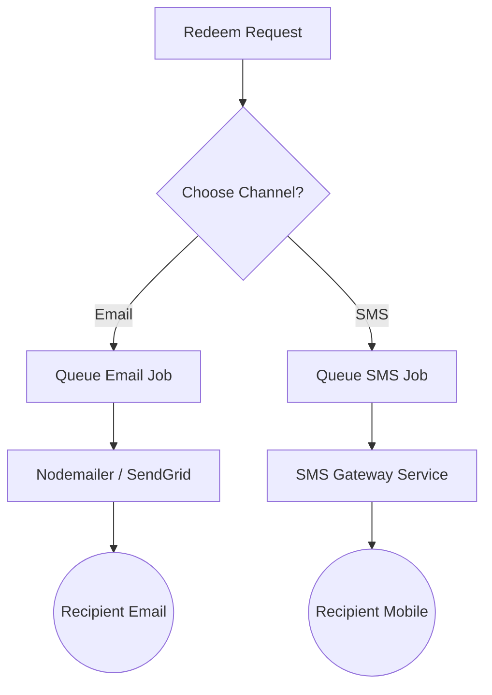

# Design Proposal: SMS Giftcode Delivery & Verification OTP Flow

Integrating SMS delivery alongside the current email notification flow is an excellent idea. It provides:
- **Better Accessibility**: Recipients who may not check their email frequently or lack constant data access can receive and redeem codes instantly.
- **Improved UX**: SMS messages can be copied directly on mobile devices with high delivery reliability.
- **Enhanced Security**: Phone numbers act as a strong secondary possession factor, which strengthens protection against unauthorized redemptions.

Below is a detailed walkthrough of how we can design and build this hybrid system in the GiftNow codebase.

---

## 1. User Interface (UI/UX) Changes

We will introduce phone number inputs and delivery channel selection controls in both the **Purchase** and **Redemption** modules.

### A. Gift Card Purchase Form (`GiftNowPurchase.tsx`)
In [GiftNowPurchase.tsx](file:///e:/GIFTNOW/giftcard-frontend/src/components/giftnow/GiftNowPurchase.tsx#L208-L231), we currently ask for `Recipient Email` and an optional message. 
We can expand this by placing a phone input next to the email field or inside a visual selector.

* **Layout Upgrade**: Use a side-by-side grid on larger displays (`grid grid-cols-1 md:grid-cols-2 gap-4`) and keep them stacked on mobile.
* **Delivery Method Toggle**: Underneath, we'll provide a selector (e.g., small, sleek pill buttons or checkboxes) allowing the buyer to decide:
  * 📧 **Email Only**
  * 💬 **SMS Only**
  * 🔄 **Both Channels**

```
+-------------------------------------------------------------+
| RECIPIENT DETAILS                                           |
|                                                             |
|  * Recipient Email               * Recipient Phone (Optional)|
|  [ email@example.com      ]     [ +977 98XXXXXXXXX          ]
|                                                             |
|  * Delivery Channels                                        |
|  ( ) Email Only     ( ) SMS Only     (*) Send to Both Channels|
+-------------------------------------------------------------+
```

---

### B. Gift Card Redemption Flow (`GiftNowRedeem.tsx`)
In [GiftNowRedeem.tsx](file:///e:/GIFTNOW/giftcard-frontend/src/components/giftnow/GiftNowRedeem.tsx#L198-L242), when the customer enters a customer-purchased gift code, we generate an OTP.
If both an email and a phone number are linked to the card, we should offer the redeemer a choice before triggering the OTP:

1. **Step 1.5 (Dynamic Selector)**: 
   * When they hit "Verify Code", if the card contains both `recipientEmail` and `recipientPhone`, show a clean prompt:
     > **"Where should we send your 6-digit verification code?"**
   * Provide two option cards with modern icons:
     * 📧 **Email** (Show masked: `t***t@example.com`)
     * 💬 **SMS** (Show masked: `98******45`)
2. **Dispatch**: The user selects one, hits "Send Verification Code", and then proceeds to enter the 6-digit OTP in the subsequent screen.

---

## 2. Database Schema Updates

In [schema.prisma](file:///e:/GIFTNOW/giftcard-backend/prisma/schema.prisma#L80-L114):

```diff
model GiftCard {
  id                   String         @id @default(uuid()) @db.Uuid
  code                 String         @unique @db.VarChar(32)
  type                 GiftCardType
  amount               Decimal        @db.Decimal(12, 2)
  status               GiftCardStatus @default(ACTIVE)
  purchasedByAccountId String?        @db.Uuid
  purchaserName        String?
  purchaserEmail       String?
  isCustomerPurchase   Boolean        @default(false)
  redeemedByAccountId  String?        @db.Uuid
  recipientEmail       String?
+ recipientPhone       String?        @db.VarChar(30)
+ deliveryChannel      String         @default("EMAIL") // "EMAIL" | "SMS" | "BOTH"
  personalMessage      String?
  deliveryAddress      Json?
  ...
}
```

*Adding `recipientPhone` ensures we store who the SMS went to, enabling easy routing and audit tracing.*

---

## 3. Backend Architecture & Queue Integration

Currently, the backend uses **BullMQ** with Redis for queuing operations.



### A. Delivery Queue Integration
* **New Queue**: Add an `sms-queue` inside [delivery.service.ts](file:///e:/GIFTNOW/giftcard-backend/src/delivery/delivery.service.ts) using `@InjectQueue("sms-queue")`.
* **SMS Processor**: Create a processor file `sms.processor.ts` inside `giftcard-backend/src/delivery/processors/` to asynchronously fetch jobs from `sms-queue` and talk to the gateway provider.

### B. Local Development & Sandbox Mocking
For testing locally without incurring costs or needing real SMS API credentials:
* **Mock Gateway**: In non-production environments (`NODE_ENV !== 'production'`), we can mock the SMS gateway. Instead of calling a real API, the gateway will:
  1. Print the SMS content directly to the NestJS application logs in a highlighted console block.
  2. Write a JSON record to a local scratch file (e.g., `scratch/sms_mailbox.json`), which developer subagents or manual reviewers can read to verify codes instantly.

---

## 4. SMS Gateway Provider Options

Depending on your target market, we can configure any of the following integrations:

| Provider | Target Market | APIs & Protocols | Pros / Cons |
| :--- | :--- | :--- | :--- |
| **Sparrow SMS / Aakash SMS** | Nepal (Local) | Simple HTTP API | Best deliverability in Nepal, direct local gateway carrier rates, easy payload structures. |
| **Twilio** | International | SDK & HTTP REST | Global reach, robust client library, slightly higher costs for international routing to local carriers. |
| **AWS SNS** | Cloud-native / Global | AWS SDK | Scalable, integrated, but setup of sender IDs requires compliance checks. |

---

## 5. Security Safeguards

To prevent abuse or financial leakage:
* **Rate Limiting**: Apply standard IP-based and phone-number-based rate limiting on `send-otp` endpoints to prevent malicious parties from spamming SMS messages (which cost money).
* **OTP Lockouts**: Maintain the current strict policy: a card lock trigger is activated if there are more than 5 failed OTP entry attempts.
* **Data Masking**: Always mask phone numbers on frontend client views (e.g., only show the country code, prefix, and last 2 digits, masking the middle: `+977 98******54`).