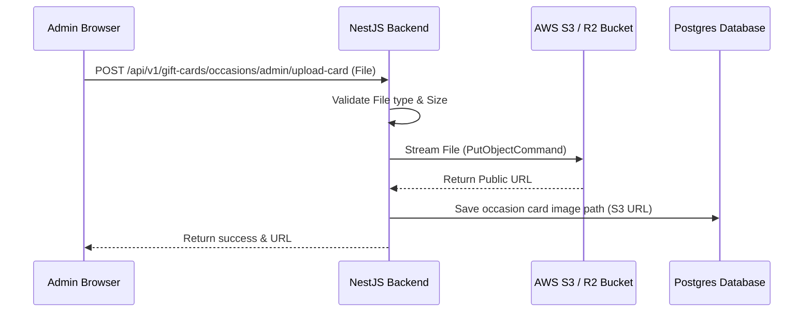

# Production Upload Guide: Transitioning to Cloud Object Storage (S3/R2)

This guide provides a step-by-step blueprint for moving runtime file uploads from the local filesystem (`public/cards`) to a scalable, secure **Cloud Object Storage** service (like **AWS S3** or **Cloudflare R2**) in production.

---

## Architecture Overview

Instead of saving images on the web server's disk, the backend streams files directly to an isolated bucket. The database stores the remote S3 URL, and the client loads the image directly from the storage provider or CDN.



---

## Step 1: Set Up Your Storage Bucket

Whether using AWS S3 or Cloudflare R2 (recommended for lower cost and free egress), follow these steps to initialize your bucket:

### 1. Create a Bucket
* Name your bucket descriptively (e.g., `giftnow-media-prod`).
* Choose a region close to your primary server/users (e.g., `us-east-1` or `ap-south-1`).

### 2. Configure CORS (Cross-Origin Resource Sharing)
To allow the frontend app to load images and allow admin previews without security blocks, apply this CORS configuration to the bucket:

```json
[
  {
    "AllowedHeaders": ["*"],
    "AllowedMethods": ["GET", "HEAD"],
    "AllowedOrigins": ["https://giftnow.com", "https://admin.giftnow.com"],
    "ExposeHeaders": []
  }
]
```

### 3. Generate Access Credentials
Create an IAM User (AWS) or API Token (R2) with **Read & Write** access specifically restricted to this bucket, and note down:
* `ACCESS_KEY_ID`
* `SECRET_ACCESS_KEY`
* `BUCKET_NAME`
* `BUCKET_REGION`
* `ENDPOINT` (Required if using Cloudflare R2 or MinIO)

---

## Step 2: Install SDK Dependencies in the Backend

Run the following command in your backend directory (`giftcard-backend/`):

```bash
npm install @aws-sdk/client-s3
```

---

## Step 3: Implement S3 Service in NestJS

Create or update a storage service to handle uploads. This avoids using Multer disk storage and streams the buffer directly to the cloud.

### 1. Configure Environment Variables
Add these keys to your production `.env` file:

```env
AWS_ACCESS_KEY_ID=your_access_key
AWS_SECRET_ACCESS_KEY=your_secret_key
AWS_REGION=us-east-1
AWS_S3_BUCKET_NAME=giftnow-media-prod
# If using Cloudflare R2, uncomment below:
# AWS_S3_ENDPOINT=https://<account-id>.r2.cloudflarestorage.com
```

### 2. Implement the Upload Logic
Create a helper service to manage the AWS S3 client:

```typescript
// giftcard-backend/src/common/services/s3.service.ts
import { Injectable } from '@nestjs/common';
import { S3Client, PutObjectCommand } from '@aws-sdk/client-s3';
import { extname } from 'path';

@Injectable()
export class S3Service {
  private s3Client: S3Client;
  private bucketName: string;

  constructor() {
    this.bucketName = process.env.AWS_S3_BUCKET_NAME;
    
    this.s3Client = new S3Client({
      region: process.env.AWS_REGION,
      credentials: {
        accessKeyId: process.env.AWS_ACCESS_KEY_ID,
        secretAccessKey: process.env.AWS_SECRET_ACCESS_KEY,
      },
      endpoint: process.env.AWS_S3_ENDPOINT || undefined, // Used for R2
    });
  }

  async uploadFile(file: Express.Multer.File, occasionSlug: string = 'general'): Promise<string> {
    const uniqueSuffix = `${Date.now()}-${Math.round(Math.random() * 1e9)}`;
    const fileExtension = extname(file.originalname);
    const safeName = occasionSlug.replace(/[^a-z0-9-_]/gi, '').toLowerCase();
    // Stores in per-occasion folders: cards/dashain/uploaded-xxx.png, cards/tihar/uploaded-xxx.png
    const key = `cards/${safeName}/${uniqueSuffix}${fileExtension}`;

    await this.s3Client.send(
      new PutObjectCommand({
        Bucket: this.bucketName,
        Key: key,
        Body: file.buffer,
        ContentType: file.mimetype,
        CacheControl: 'public, max-age=31536000',
      }),
    );

    // Return the absolute public URL of the uploaded image
    const endpoint = process.env.AWS_S3_ENDPOINT 
      ? process.env.AWS_S3_ENDPOINT.replace('https://', `https://${this.bucketName}.`)
      : `https://${this.bucketName}.s3.${process.env.AWS_REGION}.amazonaws.com`;
      
    return `${endpoint}/${key}`;
  }
}
```

---

## Step 4: Update the Upload Controller

Modify your `uploadCard` endpoint in occasion.controller.ts to use memory storage and stream the buffer via S3 Service:

```typescript
// giftcard-backend/src/occasion/occasion.controller.ts
import { 
  Controller, Post, UseGuards, UseInterceptors, UploadedFile, BadRequestException 
} from '@nestjs/common';
import { FileInterceptor } from '@nestjs/platform-express';
import { JwtAuthGuard } from '../auth/jwt-auth.guard';
import { RolesGuard } from '../auth/roles.guard';
import { Roles } from '../auth/roles.decorator';
import { S3Service } from '../common/services/s3.service';

@Controller('gift-cards')
export class OccasionController {
  constructor(
    private readonly service: OccasionService,
    private readonly s3Service: S3Service, // Inject S3 Service
  ) {}

  @Post('admin/upload-card')
  @UseGuards(JwtAuthGuard, RolesGuard)
  @Roles('SUPER_ADMIN', 'ADMIN', 'MODERATOR')
  @UseInterceptors(
    FileInterceptor('file', {
      limits: {
        fileSize: 5 * 1024 * 1024, // 5MB limit
      },
      fileFilter: (req, file, callback) => {
        // Enforce images only
        if (!file.mimetype.match(/\/(jpg|jpeg|png|webp)$/)) {
          return callback(new BadRequestException('Only JPG, JPEG, PNG, or WEBP files are allowed!'), false);
        }
        callback(null, true);
      },
    }),
  )
  async uploadCard(@UploadedFile() file: Express.Multer.File) {
    if (!file) {
      throw new BadRequestException('No file uploaded');
    }
    
    // Upload directly to cloud storage and get remote URL
    const publicUrl = await this.s3Service.uploadFile(file, 'cards');

    return {
      imagePath: publicUrl, // Saved in Database (e.g. https://bucket.s3.region.amazonaws.com/cards/name.png)
    };
  }
}
```

---

## Step 5: Frontend is Ready Automatically!

Because the API returns the absolute public URL of the uploaded image (e.g., `https://giftnow-media-prod.s3.amazonaws.com/cards/...`), the frontend will automatically write this URL to the database. 

* You do **not** need to make changes to your frontend components because Next.js `<Image>` handles absolute S3 URLs natively as long as the domains are whitelisted.

Add the bucket domain whitelist to `next.config.js` to authorize remote loading:

```javascript
// giftcard-frontend/next.config.js
module.exports = {
  images: {
    remotePatterns: [
      {
        protocol: 'https',
        hostname: 'giftnow-media-prod.s3.amazonaws.com', // Replace with your bucket url
        port: '',
        pathname: '/**',
      },
    ],
  },
}
```

---

## Production Security Checklist

1. **Verify MIME Types**: Always check the file stream headers (magic bytes) inside the backend filter to prevent users uploading renamed executable files.
2. **Limit File Sizes**: Always set a reasonable file limit (like 5MB) on your Multer interceptor configuration to prevent Denial of Service (DoS) attacks via oversized uploads.
3. **IAM Least Privilege**: Never use your root cloud credentials for backend access. Always issue a dedicated access key pair that only has permission to perform `PutObject` and `GetObject` inside the specific media folder.
4. **Cache Control**: Ensure the S3 metadata sets a long cache duration (`Cache-Control: public, max-age=31536000`) for uploaded templates. Since templates do not change, this ensures they load instantly for customers via browser caching.

---

## Step 6: Migrate Existing Local Files to S3

You already have card images stored locally in `giftcard-frontend/public/cards/`. Before switching over, you need to upload them all to the new bucket and update the database paths.

### 1. Create a Migration Script

Create this one-time migration script in your backend:

```typescript
// giftcard-backend/scripts/migrate-cards-to-s3.ts
import { S3Client, PutObjectCommand } from '@aws-sdk/client-s3';
import { PrismaClient } from '@prisma/client';
import { readFileSync, existsSync } from 'fs';
import { join, extname, basename } from 'path';
import * as dotenv from 'dotenv';

dotenv.config();

const prisma = new PrismaClient();

const s3Client = new S3Client({
  region: process.env.AWS_REGION,
  credentials: {
    accessKeyId: process.env.AWS_ACCESS_KEY_ID!,
    secretAccessKey: process.env.AWS_SECRET_ACCESS_KEY!,
  },
  endpoint: process.env.AWS_S3_ENDPOINT || undefined,
});

const BUCKET = process.env.AWS_S3_BUCKET_NAME!;
const LOCAL_CARDS_DIR = join(process.cwd(), '../giftcard-frontend/public');

// Map file extension to MIME type
function getMimeType(ext: string): string {
  const map: Record<string, string> = {
    '.png': 'image/png',
    '.jpg': 'image/jpeg',
    '.jpeg': 'image/jpeg',
    '.webp': 'image/webp',
    '.gif': 'image/gif',
  };
  return map[ext.toLowerCase()] || 'application/octet-stream';
}

async function migrate() {
  console.log('🔍 Fetching all card templates from database...');
  
  const cards = await prisma.occasionCard.findMany();
  console.log(`📦 Found ${cards.length} card templates to migrate.\n`);

  let successCount = 0;
  let skipCount = 0;
  let errorCount = 0;

  for (const card of cards) {
    const localPath = card.imagePath; // e.g. "/cards/dashain-classic.png"

    // Skip if already an absolute URL (already migrated)
    if (localPath.startsWith('http://') || localPath.startsWith('https://')) {
      console.log(`⏭️  SKIP: ${card.name} — already an absolute URL`);
      skipCount++;
      continue;
    }

    const absoluteLocalPath = join(LOCAL_CARDS_DIR, localPath);

    if (!existsSync(absoluteLocalPath)) {
      console.log(`❌ ERROR: ${card.name} — file not found at ${absoluteLocalPath}`);
      errorCount++;
      continue;
    }

    try {
      const fileBuffer = readFileSync(absoluteLocalPath);
      const ext = extname(localPath);
      const fileName = basename(localPath);
      const s3Key = `cards/${fileName}`;

      // Upload to S3
      await s3Client.send(
        new PutObjectCommand({
          Bucket: BUCKET,
          Key: s3Key,
          Body: fileBuffer,
          ContentType: getMimeType(ext),
          CacheControl: 'public, max-age=31536000', // 1 year cache
        }),
      );

      // Build the public URL
      const endpoint = process.env.AWS_S3_ENDPOINT
        ? process.env.AWS_S3_ENDPOINT.replace('https://', `https://${BUCKET}.`)
        : `https://${BUCKET}.s3.${process.env.AWS_REGION}.amazonaws.com`;

      const publicUrl = `${endpoint}/${s3Key}`;

      // Update database record
      await prisma.occasionCard.update({
        where: { id: card.id },
        data: { imagePath: publicUrl },
      });

      console.log(`✅ MIGRATED: ${card.name} → ${publicUrl}`);
      successCount++;
    } catch (err) {
      console.log(`❌ ERROR: ${card.name} — ${(err as Error).message}`);
      errorCount++;
    }
  }

  console.log('\n========================================');
  console.log(`✅ Migrated: ${successCount}`);
  console.log(`⏭️  Skipped:  ${skipCount}`);
  console.log(`❌ Errors:   ${errorCount}`);
  console.log('========================================');

  await prisma.$disconnect();
}

migrate().catch(console.error);
```

### 2. Run the Migration

```bash
cd giftcard-backend
npx ts-node scripts/migrate-cards-to-s3.ts
```

This will:
1. Read every `OccasionCard` record from your database
2. Find the corresponding local file in `public/cards/`
3. Upload it to your S3/R2 bucket
4. Update the `imagePath` field in the database from `/cards/filename.png` to the full `https://bucket.s3.region.amazonaws.com/cards/filename.png` URL
5. Skip any already-migrated records (idempotent — safe to run multiple times)

---

## Step 7: Set Up a CDN Layer (Optional but Recommended)

A CDN caches your card images at edge locations worldwide, making them load instantly for users in any country.

### Option A: Cloudflare (Free Tier Available)

If you're using **Cloudflare R2**, a CDN is built in:

1. Go to your Cloudflare Dashboard → R2 → Your Bucket → **Settings**
2. Under **Public Access**, enable "Allow Access"
3. Connect a **Custom Domain** (e.g., `media.giftnow.com`)
4. Cloudflare will automatically cache and serve your images from the nearest edge server

Your image URLs will now be: `https://media.giftnow.com/cards/filename.png`

### Option B: AWS CloudFront

If you're using **AWS S3**:

1. Go to AWS Console → CloudFront → **Create Distribution**
2. Set **Origin Domain** to your S3 bucket (`giftnow-media-prod.s3.amazonaws.com`)
3. Set **Cache Policy** to `CachingOptimized` (recommended)
4. Add your custom domain as **Alternate Domain Name (CNAME)**: `media.giftnow.com`
5. Attach an **SSL Certificate** via AWS Certificate Manager (ACM)

After propagation (~15 minutes), update your `next.config.js`:

```javascript
// giftcard-frontend/next.config.js
module.exports = {
  images: {
    remotePatterns: [
      {
        protocol: 'https',
        hostname: 'media.giftnow.com',
        port: '',
        pathname: '/**',
      },
    ],
  },
}
```

---

## Step 8: Clean Up Deleted Files from S3

When an admin deletes a card template or an entire occasion, the uploaded image should also be removed from S3 to avoid storage costs and orphaned files.

### 1. Add a Delete Method to S3Service

```typescript
// Add to giftcard-backend/src/common/services/s3.service.ts
import { DeleteObjectCommand } from '@aws-sdk/client-s3';

// Inside the S3Service class:
async deleteFile(fileUrl: string): Promise<void> {
  try {
    // Extract the S3 key from the full URL
    // e.g., "https://bucket.s3.region.amazonaws.com/cards/filename.png" → "cards/filename.png"
    const url = new URL(fileUrl);
    const key = url.pathname.startsWith('/') ? url.pathname.slice(1) : url.pathname;

    await this.s3Client.send(
      new DeleteObjectCommand({
        Bucket: this.bucketName,
        Key: key,
      }),
    );
  } catch (error) {
    // Log but don't throw — deletion failure should not block the user
    console.error(`Failed to delete S3 file: ${fileUrl}`, error);
  }
}
```

### 2. Call It During Card/Occasion Deletion

Update your `OccasionService` to call `s3Service.deleteFile(card.imagePath)` before removing the database record:

```typescript
// In occasion.service.ts — deleteCard method
async deleteCard(cardId: string) {
  const card = await this.prisma.occasionCard.findUnique({ where: { id: cardId } });

  if (card && card.imagePath.startsWith('https://')) {
    await this.s3Service.deleteFile(card.imagePath);
  }

  return this.prisma.occasionCard.delete({ where: { id: cardId } });
}

// In occasion.service.ts — deleteOccasion method
async deleteOccasion(occasionId: string) {
  // First, delete all card images from S3
  const cards = await this.prisma.occasionCard.findMany({
    where: { occasionId },
  });

  for (const card of cards) {
    if (card.imagePath.startsWith('https://')) {
      await this.s3Service.deleteFile(card.imagePath);
    }
  }

  // Then delete the occasion (cascade deletes card DB records)
  return this.prisma.occasion.delete({ where: { id: occasionId } });
}
```

---

## Step 9: Testing the Migration

Before going fully live, run through this checklist:

### Pre-Migration Tests
- [ ] Run migration script on a **staging database** first (never directly on production)
- [ ] Verify all card images load correctly on the staging frontend
- [ ] Test creating a new occasion and uploading a new card image via the admin panel
- [ ] Test deleting a card template and verify the S3 object is also removed
- [ ] Test deleting an entire occasion and verify all its card images are cleaned up

### Post-Migration Verification
- [ ] Open the buy page (`/giftnow/buy`) and confirm all occasion card images render
- [ ] Open the admin occasions panel and verify card previews load from S3 URLs
- [ ] Check the database — all `imagePath` values should be full `https://` URLs
- [ ] Run `ls giftcard-frontend/public/cards/` — local files can now be safely archived or deleted

### Load Testing
- [ ] Open the card picker on mobile (test slow 3G connection)
- [ ] Verify CDN caching headers with: `curl -I https://media.giftnow.com/cards/some-file.png`
- [ ] Confirm `Cache-Control: public, max-age=31536000` is present in the response

---

## Step 10: Rollback Plan

If something goes wrong after switching to S3, here is how to revert:

### Quick Rollback (< 5 minutes)
1. **Revert the controller code**: Switch the `upload-card` endpoint back to Multer `diskStorage` (restore the original `occasion.controller.ts`)
2. **Revert the database**: Run a SQL query to convert absolute URLs back to local paths:
   ```sql
   UPDATE "OccasionCard" 
   SET "imagePath" = REPLACE("imagePath", 'https://giftnow-media-prod.s3.amazonaws.com', '')
   WHERE "imagePath" LIKE 'https://giftnow-media-prod.s3.amazonaws.com%';
   ```
3. **Redeploy** the backend with the reverted code

### Prevent Data Loss
- Keep the local `public/cards/` files as a backup for at least 30 days after migration
- Keep the S3 bucket versioning enabled so accidentally deleted files can be recovered

---

## Cloud Storage Provider Comparison

| Feature | AWS S3 | Cloudflare R2 | Google Cloud Storage | Supabase Storage |
|---|---|---|---|---|
| **Free Tier** | 5 GB / 12 months | 10 GB forever | 5 GB / 12 months | 1 GB forever |
| **Egress (Data Transfer Out)** | $0.09/GB | **Free** | $0.12/GB | Free up to 2 GB |
| **Storage Cost** | $0.023/GB/month | $0.015/GB/month | $0.020/GB/month | $0.021/GB/month |
| **Built-in CDN** | CloudFront (extra cost) | **Included free** | Cloud CDN (extra) | Included |
| **S3-Compatible API** | ✅ Native | ✅ Full compatible | ❌ Different API | ✅ Compatible |
| **Best For** | Enterprise / AWS ecosystem | **Cost-effective, free egress** | GCP ecosystem | Small projects |
| **Recommendation** | Good | **Best for GiftNow** | Good | Good for MVPs |

> **Our recommendation**: Use **Cloudflare R2** for GiftNow. It uses the same S3-compatible API (so the code above works identically), has **zero egress fees** (you never pay for users viewing card images), and includes a built-in global CDN at no extra cost.

---

## Summary: Files You Will Create or Modify

| File | Action | Description |
|---|---|---|
| `giftcard-backend/.env` | **MODIFY** | Add AWS/R2 credentials and bucket config |
| `giftcard-backend/src/common/services/s3.service.ts` | **NEW** | S3 upload and delete helper service |
| `giftcard-backend/src/occasion/occasion.controller.ts` | **MODIFY** | Switch from Multer diskStorage to memory + S3 upload |
| `giftcard-backend/src/occasion/occasion.service.ts` | **MODIFY** | Add S3 delete calls on card/occasion deletion |
| `giftcard-backend/src/occasion/occasion.module.ts` | **MODIFY** | Register `S3Service` as a provider |
| `giftcard-backend/scripts/migrate-cards-to-s3.ts` | **NEW** | One-time migration script for existing local files |
| `giftcard-frontend/next.config.js` | **MODIFY** | Whitelist S3/CDN domain in `remotePatterns` |